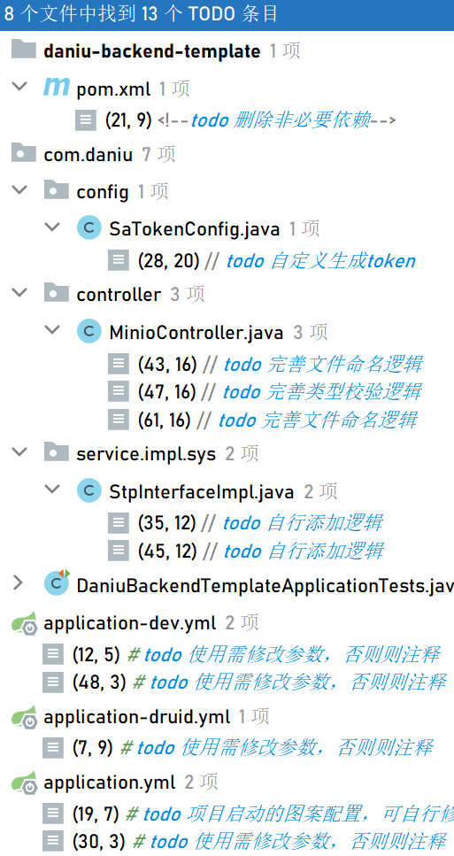

# daniu-backend-template

这是一个基于 Springboot 框架的后端项目模板，旨在帮助快速搭建一个稳健的后端服务。该模板集成了以下技术和工具，提供了一套完整的开发环境和基础功能。

## 技术栈

- **Sa-token**：国产轻量级权限验证框架，官方文档请查阅 [sa-token.cc](https://sa-token.cc/index.html)。

- **日志记录工具**：使用 Logback 进行日志记录。

- **文档生成工具**：结合 Knife4j 可以方便地生成 API 文档。

- **OSS集成**：集成 Minio 作为对象存储系统，用于处理文件上传和存储。

- **定时任务**：Quartz 实现定时任务功能，可灵活配置定时任务。

- **数据库**：使用 Druid 数据源管理连接池，数据库选用 Mysql，配合 Mybatis Plus 提供便捷的数据库操作。

- **集成Redis缓存**：有效地提升后端服务的性能和扩展性，加快数据访问速度并减轻数据库压力。

- **字段脱敏**：使用注解实现灵活的字段脱敏功能。

- **工具类**：使用 Hutool, Gson 等工具类库简化开发过程。

## 如何使用

1. git clone https://github.com/FangDaniu666/daniu-backend-template.git  
  或下载该仓库代码到本地。
2. 搜索项目中标记的`todo`，根据实际需要，配置数据库连接、Redis、Minio 等信息，
  表结构可参考 [user.sql](https://github.com/FangDaniu666/daniu-backend-template/blob/main/src/main/resources/user.sql)。
3. 运行项目，访问 http://localhost:8618/api/doc.html 查看 API 文档。

## 注意事项

- 请根据实际需求修改配置文件和相关代码。
- 在使用之前，请确保详细阅读每个依赖和组件的官方文档，了解其用法和配置方式。

如果您对该模板有任何疑问或建议，请随时提出。希望这个模板能帮助您快速搭建并开发出您需要的后端服务！
